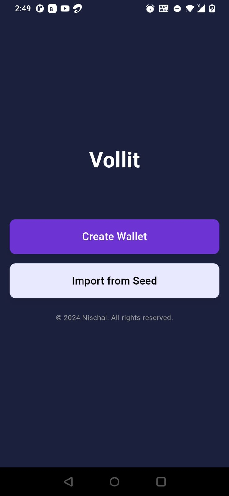
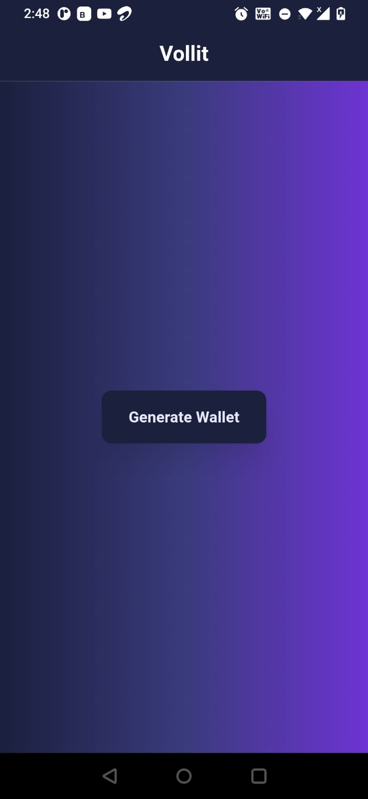
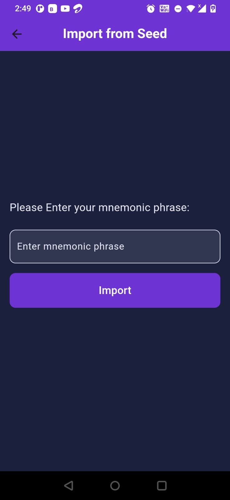
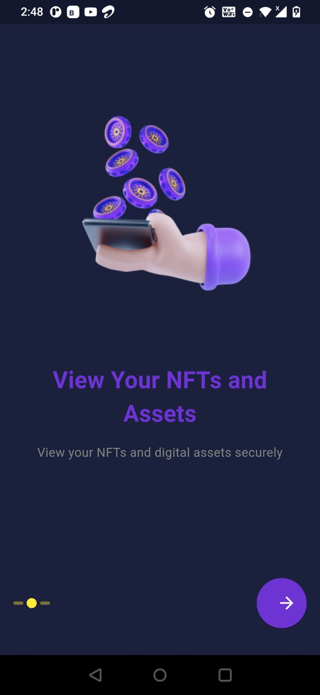
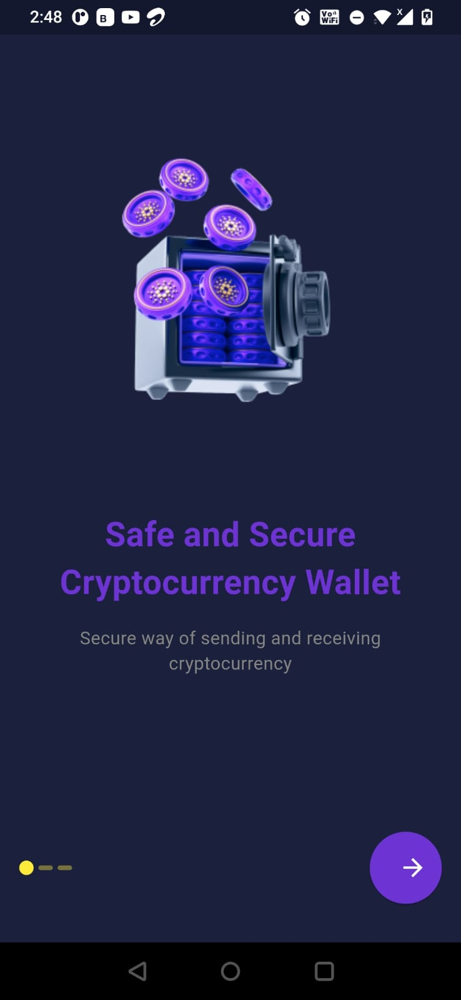
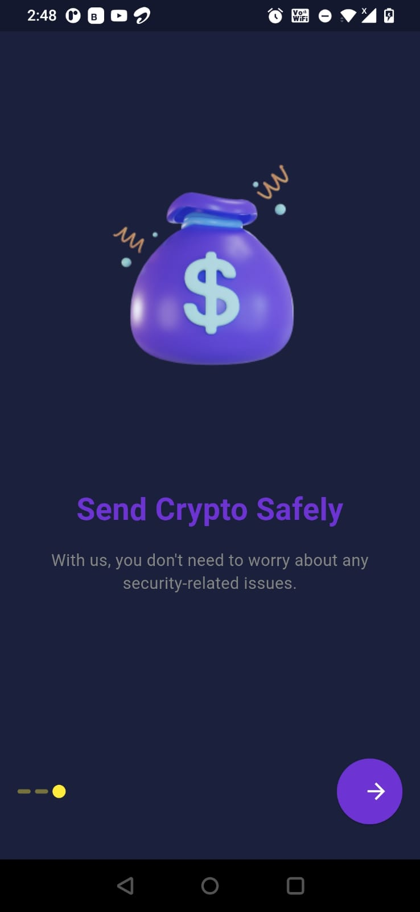
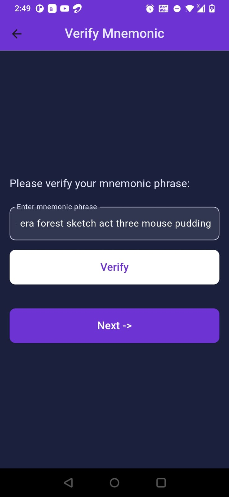
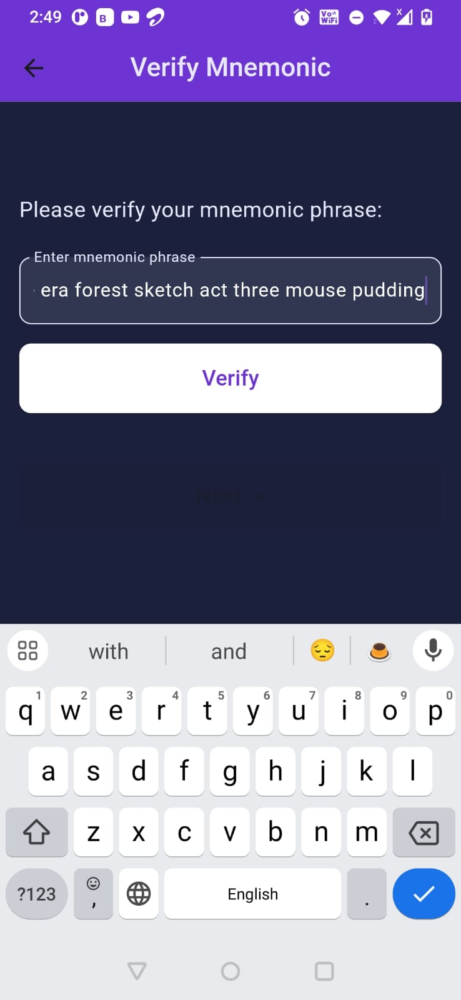
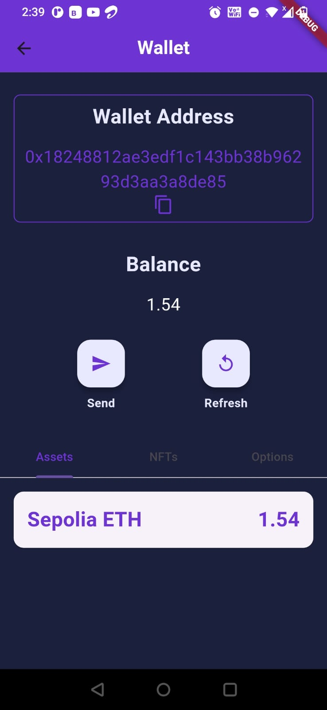

# Vollit Wallet

Vollit Wallet is a blockchain wallet application built using Flutter for the frontend and Flask for the backend. The wallet interacts with the Ethereum blockchain using Web3dart and integrates with Alchemy and Moralis API keys to fetch wallet data.

## Features

- **Clean and Easy-to-Navigate UI**: Designed for optimal user experience with intuitive navigation.
- **Wallet Generation**: Generate new Ethereum wallets with mnemonic phrases.
- **Wallet Import**: Import existing wallets using mnemonic phrases or private keys.
- **Wallet Details**: View wallet balances and transaction history.
- **Secure Authentication**: Provides secure access to your wallet data.
- **Real-time Data**: Fetches and displays real-time data from the Ethereum blockchain using Alchemy and Moralis APIs.

## Tech Stack

- **Frontend**: Flutter, Web3dart
- **Backend**: Flask
- **APIs**: Alchemy, Moralis

## Run Locally

Clone the project

```bash
git clone https://github.com/yourusername/vollit_wallet
```

Backend Setup
Navigate to the backend directory


```bash

cd backend
```
Create a virtual environment

```bash

python -m venv venv
```
Activate the virtual environment

For Windows:

```bash
.\venv\Scripts\activate
```
For macOS/Linux:

```bash
source venv/bin/activate
```
Install dependencies

```bash

pip install -r requirements.txt
```
Start the Flask server

```bash

flask run
```

Frontend Setup
Navigate to the frontend directory

```bash

cd ../vollit_wallet
```

Install dependencies

```bash
flutter pub get
```
Start the app

```bash

flutter run
```

##Screenshots













and more...